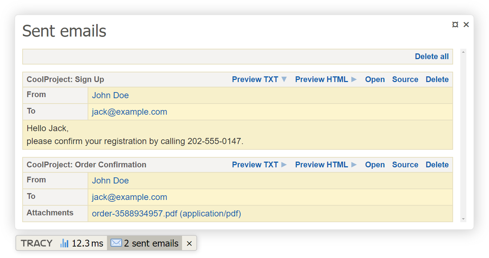

# Nextras Mail Panel

[](https://packagist.org/packages/nextras/mail-panel)
[](https://packagist.org/packages/nextras/mail-panel)

Nextras Mail Panel is an extension for [Nette Framework](https://nette.org) which captures sent e-mails in development mode and shows them in [Tracy](https://tracy.nette.org) bar.


### Screenshot




### Installation

1. Install library via composer:

	```bash
	composer require nextras/mail-panel
	```

2. Update your local configuration (e.g. `config.local.neon`) to register Mail Panel to Tracy<br>and to change default mailer to `Nextras\MailPanel\FileMailer`.

	```yml
	tracy:
		bar:
			- Nextras\MailPanel\MailPanel(%tempDir%/mail-panel-latte)

	services:
		nette.mailer:
			class: Nette\Mail\IMailer
			factory: Nextras\MailPanel\FileMailer(%tempDir%/mail-panel-mails)
	```


### Usage

Messages has to be sent by injected instance of `Nette\Mail\IMailer`.

```php
class ExamplePresenter extends BasePresenter
{
	/** @var Nette\Mail\IMailer @inject */
	public $mailer;


	public function actionSendMail()
	{
		$mail = new Nette\Mail\Message();
		$mail->setFrom('john.doe@example.com', 'John Doe');
		$mail->addTo('jack@example.com');
		$mail->setSubject('Order Confirmation');
		$mail->setHtmlBody('Hello Jack,<br>Your order has been accepted.');

		$this->mailer->send($mail);
	}
}
```


### License

*Based on [MailPanel by Jan Drábek](https://packagist.org/packages/jandrabek/nette-mailpanel).*

New BSD License. See full [license](license.md).
